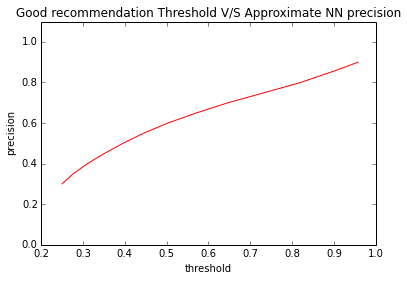

# Apache-email-recommendation
This project is all about recommending emails to read to a user based on his/her current activity and session information. Though it is a recommendation task standard matrix factorization like SVD, ALS will not work as we do not have a user profile built. Thus, we use different approaches like Locality Sensitive Hashing for Approximate Nearest Neighbors, and Markov Chain to give relevant recommendations.

### Markov Chain:
Using markov chain has the advantage that it captures more than just the textual similarity between different documents. At the basic level Markov Chain learns the probability of reading jth email given that ith email is being read at present `P(email[j]|email[i])`. This is called the `transition probability`. It makes an assumption that the activites done in the past don't affect the future. These conditions are true in our case. We need lots of sessionized data to learn transition probabitlites but, currently we do not have it in that format.

Solution: Collect the data in that format but in a smarter way. Recommend emails based on just textual similarity because it is very likely that the emails talk about the same topic and the user will be interested in them.

### Cosine similarity:
Cosine similarity is a very simple yet powerful measure of similarity between 2 documents and ranges from 0 to 1, 1 being highest similarity.
  <p>First, we need to clean the data, stem, tokenize, remove stop words and generate the TF-IDF vectors. Then compute pairwise cosine similarity and take the top 10 similar emails and store them.
   Sounds easy and it is. The only problem is the memory requirement. It is of the order of O(n<sup>2</sup>). For the sample dataset used which contains about 22431 the memory required was 4 GB. This will soon be practiacally challenging with large datasets.</p>
   
## Locality Sensitive Hashing (LSH):
LSH is a technique that maps the datapoints based into hash buckets based on the distance (1 - similarity) between them. It gives good approximation of the nearest neighbors to the query point without having to compute the similarity/distance to all the points in the dataset. LSH Algorithms map similar points into the same hashbucket and dissimilar points into different hasbuckets. Due to this property we have to only search the hash bucket the point lies in and points in 1-2 closest buckets. This drastically reduces the memory requirements and the time to get the recommendations.

Before we trust this method we need to evaluate its performance. The pairwise cosine similarity recommendations are used as the ground truth and recommendation by LSH are evaluated. Though we can get a fixed number of recommendations for each email (say 10) mostly the top 3-5 are actually similar with *similarity measure >0.5 (threshold)*. We call them as good recommendations and treat them as ground truth. Hence, to compare our LSH model with the cosine similarity model we check the `Precision` of our model by varying the threshold of good recommendations.

<table>
<tr>
<th>Threshold</th>
<td>0.3
<td>0.35
<td>0.4
<td>0.45
<td>0.5
<td>0.55
<td>0.6
<td>0.65
<td>0.7
<td>0.75
<td>0.8
<td>0.86
<td>0.9
</tr>
<tr>
<th>Precision
<td>0.25
<td>0.28
<td>0.31
<td>0.35
<td>0.4
<td>0.45
<td>0.5
<td>0.57
<td>0.65
<td>0.73
<td>0.82
<td>0.91
<td>0.96
</tr>
</table>

<p align="center">
  
</p>

## Execution instructions:
1. Requires external package: com.github.karlhigley:spark-neighbors_2.10:0.2.2
```
./spark-shell --packages com.github.karlhigley:spark-neighbors_2.10:0.2.2
scala> import com.github.karlhigley.spark.neighbors.ANN
```
If the above executes without error proceed:

2. Copy and paste the contents in the below script in the `spark-shell`
https://github.com/shahanesanket/Apache-email-recommendation/blob/master/scala/lsh_recs.scala
```
var numFeatures = 10000
var collectionName = "lucidfind"
var query = "*:*"
var zkhost = "localhost:9983/lwfusion/3.1.0/solr"
var idField = "hash_id"
var contentField = "body"
var outputCollectionName = "email-recs"
var nNeighbors = 10

Set these parameters in the script as per the problem statement.
```

**The script performs the following tasks:**

1. Load the appropriate fields from the Solr collection
2. Removes records which have missing values in the contents
3. Removes outliers based on the length by calculating mean and standard deviation statistcs. mean+3xstd.
4. Tokenize, Stem, Remove stopwords
5. Generate TFIDF using HashingTF, IDF
6. Map the unique_id to indexes.
7. Use LSH to find approximate nearest neighbors
8. Get the recommendations
9. Reverse map the indexes to unique_id
10. Write the output back to solr.

>Notebooks folder contains the prototyping code done in python. It references the data in sample-data folder but it is not posted in the repository. If you need the data let me know I can provide a zip file.
